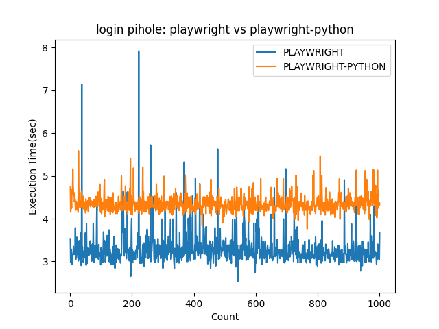

+++
title = "速度测试：playwright vs playwright-python"
date = "2021-01-22"
[taxonomies]
categories = ["其它"]
tags = ["playwright"]
+++

最近在网络上看到一篇文章：[puppeteer vs selenium vs playwright, a speed comparison](https://blog.checklyhq.com/puppeteer-vs-selenium-vs-playwright-speed-comparison/)，作者是 [Checkly 团队](https://www.checklyhq.com/), 他们对 puppeteer、playwright 和 selenium 的执行速度做了量化的比较，得出的结论是 puppeteer 和 playwright 比 selenium 快了大概 20% 左右，有兴趣的同学可以看看。

受此启发，我对 [playwright](https://github.com/microsoft/playwright) 和 [playwright-python](https://github.com/microsoft/playwright-python) 也做了同样的测试。

<!-- more -->

playwright 是微软开源的浏览器自动化操作的 node.js 库，playwright-python 是它对应的官方 python 版本。

## 测试方法

如果你想直接了解测试结果，请跳过这一节。不过我仍然建议你继续阅读，以便于更好的理解测试结果的确切含义。

### 基本条件

为了使测试对象尽可能的在相似的环境中运行，我们约定了以下基本条件：

1. **资源平等**：每个测试都是在同一台“静止的”机器上依次执行的，也就是说，在测试期间，后台没有发生繁重的工作负载。
2. **简单执行**：脚本的执行方式如每个工具的“入门”文档所示。例如：playwright 的 `node script.js`，并且尽量使用默认的命令行选项。
3. **相似的脚本**：尽量减小测试中不同工具之间编写脚本的差异。
4. **最新版本**：测试对象都使用目前为止发布的最新版本。
5. **相同的浏览器**：所有的脚本都在无头模式的 Chromium 浏览器上执行。

所有条件的细节，请参阅下一节。

### 测试参数

每个测试脚本都**成功的连续执行 1000 次**。

测试对象的版本信息如下：

- playwright：1.8.0
- playwright-python：1.8.0a1

### 衡量指标

对每个测试都衡量以下几个指标，它们都是从这 1000 次的执行结果中计算出来的：

- **平均执行时间**（秒）
- **标准差**（秒）：方差的算术平方根，反应执行时间的离散程度。
- **相对标准偏差**：标准差除以平均值再乘以 100%，反应执行时间相对于平均值的波动程度。
- **P95**：丢弃最慢的 5% 的数据，剩下的耗时最长的结果，反应非极端情况下仍然较长的执行时间。

### 尚未衡量的指标

- **可靠性**：不可靠的脚本即使执行的再快也是毫无意义的。
- **并行执行**：对自动化工具而言，并行执行是一个很重要的概念。但是，本次测试首要关注的是单个脚本的执行速度。
- **非本地执行**：和并行化一样，脚本的远程执行也是一个重要的话题，但同样不在本文的讨论范围之内。
- **资源耗用**：执行测试耗用的内存和 CPU 计算同样未予考虑。

## 测试结果

为了避免网络延迟带来的影响，脚本操作的是我之前在[本地的树莓派上搭建的 pihole 服务](https://luizyao.com/blog/post/2020-12-06-pi-hole-getting-started-on-raspberry-pi/)。

### 简单的场景

在这个场景中，脚本执行一个 pi-hole 的快速登录操作，预计只需要几秒钟，这可以明显的区分出测试对象启动速度之间的差异。

以下是我们的汇总测试结果：

在这种场景下，playwright 比 playwright-python 的速度快了 20% 以上，但是 playwright-python 拥有更低的离散度和变异性。

### 复杂的场景

在这个场景中，我们登录 pihole 添加一个黑名单和白名单，然后再删除它们。我们来看看在这种稍微复杂的场景中，是否还能得到上面的结论。

以下是我们的汇总测试结果：

这里 playwright 相对于 playwright-python 的速度优势降到了 10% 左右，但同时它们的离散度和差异性趋于重合。

## 结论

playwright 确实相对于 playwright-python 有执行速度上的优势，在一些脚本操作简单，执行时间短的场景中有 20% 以上的优势，但是对于一些复杂的、执行时间较长的场景，优势大概在 10% 左右。

其实，不管是对于 playwright、puppeteer 还是 selenium，速度永远都不是在选择工具时的第一考虑要素，更要考虑到自身的需求、脚本开发的效率等等。

**以上结论仅供参考**。

## 其它

本文所有的测试脚本、测试结果都可以在这个[仓库](https://github.com/luizyao/headless-benchmarks)中找到，包括自动计算结果，并生成本文所有表格、图片的一个脚本，在写这个脚本的时候，还发现了 rich 的一个 [BUG](https://github.com/willmcgugan/rich/issues/953)，也算是一个意外的收获吧。

> [rich](https://github.com/willmcgugan/rich) 是一个 python 库，能够在终端打印漂亮的输出，Github 上超过 2 万 star，有兴趣的可以试试。